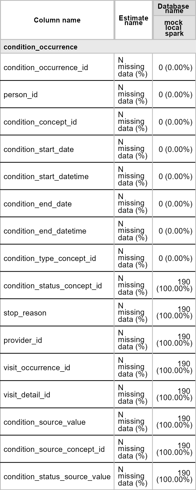

<!-- README.md is generated from README.Rmd. Please edit that file -->

# OmopSparkConnector

<!-- badges: start -->

[](https://github.com/oxford-pharmacoepi/OmopSparkConnector/actions/workflows/R-CMD-check.yaml)
<!-- badges: end -->

OmopSparkConnector provides a Spark specific implementation of an OMOP
CDM reference as defined by the omopgenerics R package.

## Installation

You can install the development version of OmopSparkConnector from
[GitHub](https://github.com/) with:

``` r
# install.packages("devtools")
devtools::install_github("oxford-pharmacoepi/OmopSparkConnector")
```

## Creating a cdm reference using Sparklyr

Let’s first load the R libraries.

``` r
library(dplyr)
library(sparklyr)
library(OmopSparkConnector)
```

To work with OmopSparkConnector, we will first need to create a
connection to our data using the sparklyr. In the example below, we have
a schema called “omop” that contains all the OMOP CDM tables and then we
have another schema where we can write results during the course of a
study. We also set a write prefix so that all the tables we write start
with this (which makes it easy to clean up afterwards and avoid any name
conflicts with other users).

``` r
con <- sparklyr::spark_connect(.....)
cdm <- cdmFromSpark(con,
  cdmSchema = "omop",
  writeSchema = "results",
  writePrefix = "study_1_"
)
```

For this introduction we’ll use a mock cdm where we have a small
synthetic dataset in a local spark database.

``` r
cdm <- mockSparkCdm(path = file.path(tempdir(), "temp_spark"))
#> ! Validation has been turned off, this is not recommended as analytical
#>   packages assumed the cdm_reference object fulfills the cdm validation
#>   criteria.
#> ! Validation has been turned off, this is not recommended as analytical
#>   packages assumed the cdm_reference object fulfills the cdm validation
#>   criteria.
```

## Cross platform support

With our cdm reference created, we now a single object in R that
represents our OMOP CDM data.

``` r
cdm
#> 
#> ── # OMOP CDM reference (sparklyr) of mock local spark ─────────────────────────
#> • omop tables: cdm_source, concept, concept_ancestor, concept_relationship,
#> concept_synonym, condition_occurrence, drug_strength, observation_period,
#> person, vocabulary
#> • cohort tables: -
#> • achilles tables: -
#> • other tables: -
```

This object contains references to each of our tables

``` r
cdm$person |>
  dplyr::glimpse()
#> Rows: ??
#> Columns: 18
#> Database: spark_connection
#> $ person_id                   <int> 1, 2, 3, 4, 5, 6, 7, 8, 9, 10
#> $ gender_concept_id           <int> 8507, 8532, 8532, 8507, 8507, 8507, 8507, …
#> $ year_of_birth               <int> 1960, 1969, 1976, 1981, 1987, 1953, 1999, …
#> $ month_of_birth              <int> 6, 3, 11, 3, 12, 10, 5, 12, 10, 4
#> $ day_of_birth                <int> 24, 7, 12, 2, 26, 31, 29, 10, 17, 25
#> $ race_concept_id             <int> NA, NA, NA, NA, NA, NA, NA, NA, NA, NA
#> $ ethnicity_concept_id        <int> NA, NA, NA, NA, NA, NA, NA, NA, NA, NA
#> $ birth_datetime              <dttm> 1970-01-01 01:00:00, 1970-01-01 01:00:00, …
#> $ location_id                 <int> NA, NA, NA, NA, NA, NA, NA, NA, NA, NA
#> $ provider_id                 <int> NA, NA, NA, NA, NA, NA, NA, NA, NA, NA
#> $ care_site_id                <int> NA, NA, NA, NA, NA, NA, NA, NA, NA, NA
#> $ person_source_value         <chr> NA, NA, NA, NA, NA, NA, NA, NA, NA, NA
#> $ gender_source_value         <chr> NA, NA, NA, NA, NA, NA, NA, NA, NA, NA
#> $ gender_source_concept_id    <int> NA, NA, NA, NA, NA, NA, NA, NA, NA, NA
#> $ race_source_value           <chr> NA, NA, NA, NA, NA, NA, NA, NA, NA, NA
#> $ race_source_concept_id      <int> NA, NA, NA, NA, NA, NA, NA, NA, NA, NA
#> $ ethnicity_source_value      <chr> NA, NA, NA, NA, NA, NA, NA, NA, NA, NA
#> $ ethnicity_source_concept_id <int> NA, NA, NA, NA, NA, NA, NA, NA, NA, NA

cdm$observation_period |>
  dplyr::glimpse()
#> Rows: ??
#> Columns: 5
#> Database: spark_connection
#> $ observation_period_id         <int> 1, 2, 3, 4, 5, 6, 7, 8, 9, 10
#> $ person_id                     <int> 1, 2, 3, 4, 5, 6, 7, 8, 9, 10
#> $ observation_period_start_date <date> 1990-05-26, 1980-12-06, 2004-02-22, 2017…
#> $ observation_period_end_date   <date> 2009-03-08, 1981-08-30, 2006-01-11, 2018…
#> $ period_type_concept_id        <int> NA, NA, NA, NA, NA, NA, NA, NA, NA, NA
```

With this we can use familiar dplyr code . For example, we can quickly
get a count of our person table.

``` r
cdm$person |> 
  tally()
#> # Source:   SQL [?? x 1]
#> # Database: spark_connection
#>       n
#>   <dbl>
#> 1    10
```

Behind the scenes, the dbplyr R package is translating this to SQL.

``` r
cdm$person |> 
  tally() |> 
  show_query()
#> <SQL>
#> SELECT COUNT(*) AS `n`
#> FROM omop.person
```

We can also make use of various existing packages that work with a cdm
reference using this approach. For example, we can extract a summary of
missing data in our condition occurrence table using the OmopSketch
package.

``` r
library(OmopSketch)
library(flextable)

missing_condition_data <- OmopSketch::summariseMissingData(cdm, "condition_occurrence")
tableMissingData(missing_condition_data, type = "flextable")
```



## Native spark support

As well as making use of packages that provide cross-platform
functionality with the cdm reference such as OmopSketch, because
OmopSparkConnector is built on top of the sparklyr package we can also
make use of native spark queries. For example we can compute summary
statistics on one of our cdm tables using spark functions.

``` r
cdm$person |>
  sdf_describe(cols = c(
    "gender_concept_id",
    "year_of_birth",
    "month_of_birth",
    "day_of_birth"
  ))
#> # Source:   table<`sparklyr_tmp_08565f48_368a_4fd3_996d_6ce84d0937eb`> [?? x 5]
#> # Database: spark_connection
#>   summary gender_concept_id  year_of_birth      month_of_birth     day_of_birth 
#>   <chr>   <chr>              <chr>              <chr>              <chr>        
#> 1 count   10                 10                 10                 10           
#> 2 mean    8519.5             1974.7             7.6                18.3         
#> 3 stddev  13.176156917368234 15.867857098199766 3.7475918193480524 10.089047967…
#> 4 min     8507               1953               3                  2            
#> 5 max     8532               1999               12                 31
```

With this we are hopefully achieving the best of both worlds. On the one
hand we can participate in network studies where code has been written
in such a way to work across database platforms. And then on the other
we are able to go beyond this approach, writing bespoke code that makes
use of Spark-specific functionality.

# Disconnecting from your spark connection

We can disconnect from our spark connection like so

``` r
cdmDisconnect(cdm)
```
